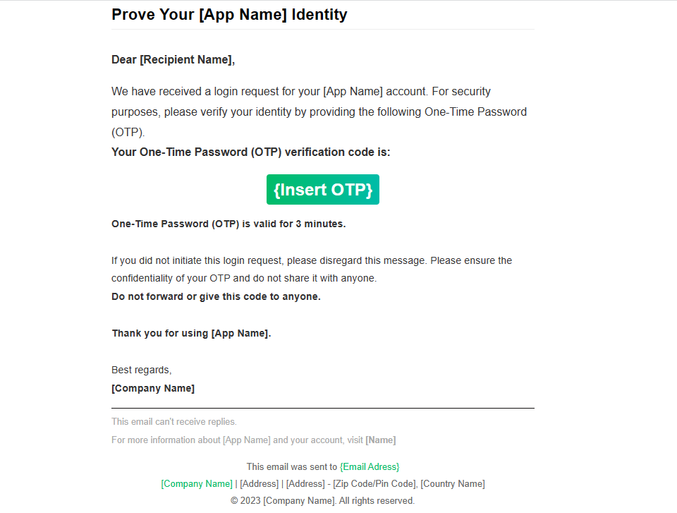

# OTP Verification Email Template

This repository contains an OTP (One-Time Password) verification email template built with HTML and CSS. The template provides a secure and user-friendly way of verifying user identity during the login process.

## Features

- Responsive design that adapts to various screen sizes and devices.
- Clear and concise instructions for users to enter the OTP code.
- Customizable OTP display area with a visually appealing design.
- Informative messages for users, including validity duration and security precautions.
- Footer section with relevant information about the company and contact details.

## Usage

1. Clone or download the repository to access the HTML and CSS files.

2. Customize the template as per your requirements. You can modify the colors, typography, and layout to match your brand's style guide.

3. Replace the placeholder `{Insert OTP}` with the dynamic OTP value you generate for each user.

4. Optionally, update the email sender's information and company details in the footer section.

5. Test the template in different email clients and devices to ensure optimal rendering and user experience.

6. Integrate the template into your email sending system or use it as a reference to build your own email generation mechanism.

## Example

You can preview the OTP verification email template by opening the `otp-verification-email-template.html` file in your web browser. The template is designed to be used within an email client, so it may not display the same way as a standalone web page.

## Credits

This OTP verification email template is inspired by the designs available on Ocoxe (https://www.ocoxe.com).

## License

This project is licensed under the [MIT License](LICENSE).
